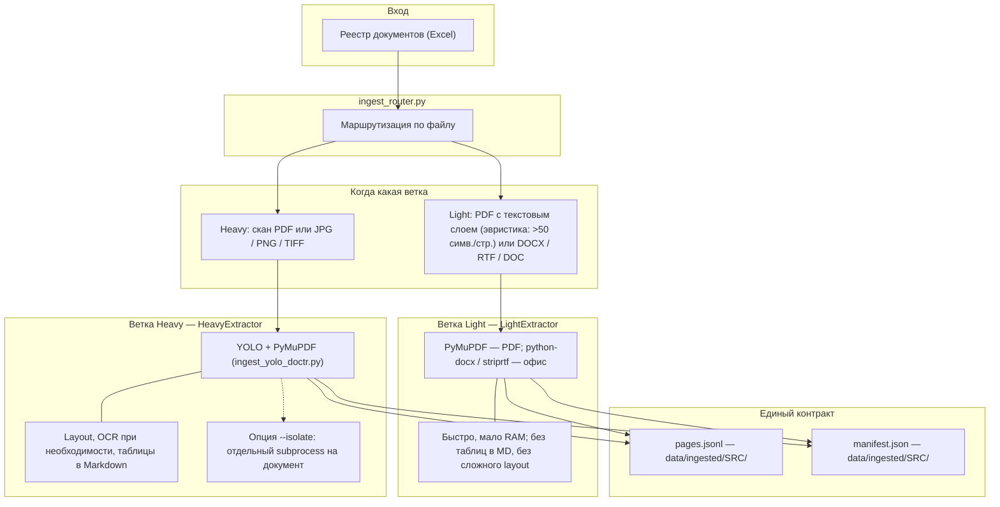

# Универсальный Ingest Router (`ingest_router.py`)

Новый верхнеуровневый пайплайн для загрузки и первичной обработки (Ingest) экологической и нормативной документации. Заменяет прямое использование `ingest_docling.py`, добавляя умную маршрутизацию.

## Архитектура и политика маршрутизации

`ingest_router.py` принимает на вход реестр документов (Excel) и автоматически решает, как лучше обработать каждый файл, балансируя между скоростью, потреблением памяти и качеством извлечения.

Документы маршрутизируются на две ветки:
1. **Light ветка (`LightExtractor`)**: Использует `PyMuPDF` (`fitz`) для PDF и `python-docx`/`striprtf` для офисных форматов.
   - **Когда выбирается:** Если PDF имеет качественный текстовый слой (эвристика: > 50 символов на страницу), либо это нативный офисный формат (DOCX, RTF, DOC).
   - **Преимущества:** Максимально быстро, потребляет минимум RAM, работает в основном потоке.
   - **Недостатки:** Не извлекает таблицы в Markdown, не делает сложный Layout-анализ.

2. **Heavy ветка (`HeavyExtractor`)**: Основной маршрут — **`ingest_yolo_doctr.py`** (DocLayout-YOLO + PyMuPDF + EasyOCR при необходимости).
   - **Когда выбирается:** Для PDF и изображений, когда нужен layout/OCR и таблицы в markdown; в батче — по эвристикам роутера (сканы, изображения и т.д.).
   - **Преимущества:** Локальный пайплайн без внешних API, таблицы и формулы в markdown, устойчивее по RAM, чем Docling на тяжёлых сканах.
   - **Режим изоляции (`--isolate`)**: Рекомендуется на машинах с ~16 ГБ RAM — каждый документ в отдельном subprocess.

3. **Docling** (`ingest_docling.py`, `parser_mode=docling` в API): альтернативный парсер, не ветка `HeavyExtractor` по умолчанию. Часто точнее по сложной структуре PDF, но тяжелее по памяти и времени.

**Политика OCR:**
- Если PDF - скан, OCR включается автоматически (`ocr_mode="on"`).
- Если PDF имеет текст, OCR выключается (`ocr_mode="off"`).
- Можно переопределить через флаг `--ocr on|off`.

### Схема потока



## Единый выходной контракт

Вне зависимости от того, по какой ветке прошел документ, результат сохраняется в едином формате:
- `data/ingested/<SRC>/pages.jsonl` — построчный JSON с полями `{source_id, page, text, parser}`.
- `data/ingested/<SRC>/manifest.json` — статус обработки с указанием выбранного маршрута (`route`), режима OCR (`ocr_mode`) и имени парсера (`parser`).

## Конфигурация эвристик (без хардкода)

Часть порогов и параметров вынесена в `scripts/app_settings.py` и задается через переменные окружения:

- `ALTIORA_RUNNING_LINES_TOP_SCAN`, `ALTIORA_RUNNING_LINES_BOTTOM_SCAN` — сколько итераций чистки «бегущих» шапок/подвалов.
- `ALTIORA_RUNNING_LINES_MIN_FRACTION` — доля страниц (0.5..1.0), при которой строка считается колонтитулом.
- `ALTIORA_RUNNING_LINES_MAX_LEN`, `ALTIORA_RUNNING_LINES_MIN_LEN` — границы длины строки-кандидата.
- `ALTIORA_CHUNK_MAX_CHARS`, `ALTIORA_CHUNK_OVERLAP` — параметры структурного чанкования в API.
- `ALTIORA_PRELOAD_YOLO_ON_STARTUP` (`1/0`) — прогрев YOLO-модели при старте FastAPI, а не на первом запросе.

## Команды для запуска и проверки

### 1. Обработка одного документа (автоматический выбор маршрута)
Проверка на одном документе (например, PDF со сложным сканом):
```bash
python scripts/ingest_router.py --only SRC-0001
```

### 2. Обработка с изоляцией процессов (рекомендуется для больших объемов)
Для стабильной работы на 16 ГБ RAM без утечек памяти:
```bash
python scripts/ingest_router.py --isolate
```

### 3. Продолжение прерванной обработки
Пропускает документы, у которых `manifest.json` имеет статус `ok`.
```bash
python scripts/ingest_router.py --resume --isolate
```

### 4. Принудительная маршрутизация (для тестов)
Заставить все документы пройти через быструю ветку (без OCR):
```bash
python scripts/ingest_router.py --force-light
```

Заставить все документы пройти через Docling (для получения идеальных Markdown таблиц):
```bash
python scripts/ingest_router.py --force-docling --isolate
```

### 5. Принудительное управление OCR
```bash
python scripts/ingest_router.py --only SRC-0002 --ocr off
```
